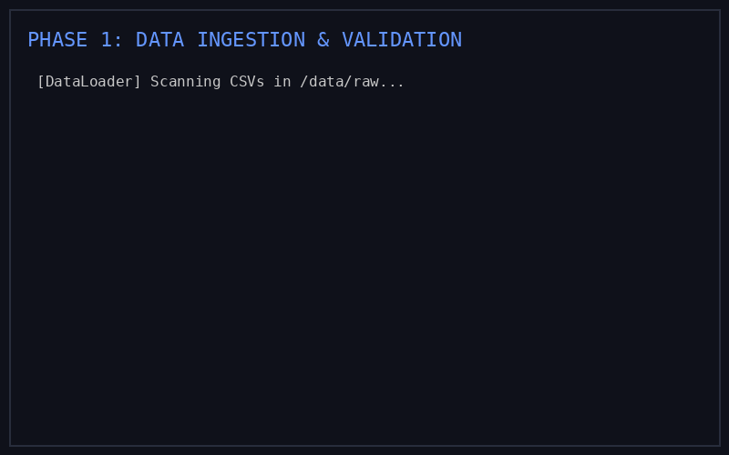

# Loan Analyzer

A SQL-based financial state machine for reconstructing time-series loan histories using recursive amortization, with correctness enforced via SQL-defined invariants.



The system ingests:

- Borrower data  
- Loan data  
- Collateral data  
- Collateral valuation data  
- Scheduled payment data  
- Actual payment data  

and computes the evolution of outstanding loan balances over time, accounting for missed payments, penalties, and compounding interest.

---

## Installation

The package can be installed directly from GitHub:

```bash
pip install git+https://github.com/zakiahmed1234/loan_analyzer.git
```

---

## Quick Start

```python
from loan_analyzer import DataLoader, DataValidation, LoanCalculation
from generate_test_data import generate_data

# 1. Generate sample data
generate_data("data")

# 2. Load and Validate
loader = DataLoader("data")
validator = DataValidation(loader)

# 3. Run recursive amortization engine
calculator = LoanCalculation(validator)
calculator.run_all()

# 4. Access computed states via DuckDB connection
con = loader.get_connection()
results = con.execute("SELECT * FROM loan_state LIMIT 5").df()
print(results)
```

---

## Project Structure

### Pipeline

Raw Data Ingestion  
→ Input Validation (Pre-Calculation Invariants)  
→ Recursive Amortization Engine (State Reconstruction)  
→ Output Validation (Post-Calculation Invariants)  
→ Audit Reconciliation Layer  
→ Metrics Computation Layer  

### Codebase Structure

```text
loan_analyzer/
├── src/
│   └── loan_analyzer/
│       ├── core/
│       │   ├── loan_system/    # Core Python logic (DataLoader, calculation, etc.)
│       │   ├── sql/            # Core SQL transformations (recursive CTEs)
│       │   └── tests/          # Data validation and invariant tests
│       ├── metrics/            # Multi-dimensional analytics modules
│       ├── utils/              # Helper utilities (Hive archiving)
│       └── __init__.py
├── docs/                       # Detailed documentation guides
├── demo.ipynb                  # End-to-end Jupyter walkthrough
├── workflow.gif                # Pipeline execution animation
├── pyproject.toml              # Build configuration
└── README.md
```

---

## Amortization

Amortization is defined as the portion of a loan payment that reduces the outstanding principal balance.

In each period, payments are applied in the following order:

1. accrued interest  
2. penalties (if any)  
3. remaining balance applied to principal reduction  

Formally, amortization is computed as:

```text
amortization =
    max(
        cash_received
        - interest_accrued
        - penalties,
        0
    )
```

The amortization amount is subtracted from the opening principal to determine the closing principal for the period, adjusted for any write-offs.

---

## Invariants and Auditability

All input and output data must satisfy a set of financial invariants that ensure correctness, consistency, and auditability. These invariants are defined in SQL to maintain modularity and enforce deterministic behavior across the pipeline.

---

## Input Invariants

All input datasets must satisfy the following invariants before loan reconstruction is performed:

- **Identifier uniqueness**  
  All primary identifiers (loan IDs, borrower IDs, payment IDs) are globally unique within their respective domains.

- **Schema conformity**  
  Input datasets conform to the expected schema definitions, including required column names and structural constraints.

- **Data type integrity**  
  All fields satisfy their expected data types (e.g. numeric, timestamp, categorical).

- **Cash flow reconciliation**  
  Payment cash flows must reconcile exactly such that:

```text
cash_received
    = interest_paid
    + principal_paid
    + fees_paid
    + penalties_paid
    + unapplied_cash
```

- **Absorbing terminal states**  
  Terminal loan states, including `paid_off`, `defaulted`, and `written_off`, are absorbing and irreversible across future timesteps.

- **Monotonic cumulative cash flow**  
  Total cumulative cash paid for a loan is monotonically nondecreasing over time.

- **Nonnegative balance constraints**  
  Outstanding balances, accrued interest, fees, and penalties remain nonnegative.

- **Temporal consistency**  
  Payment dates occur on or after the corresponding loan origination date.

---

## Output Invariants

The calculated loan state output must satisfy the following invariants:

- **Temporal balance continuity**  
  For every loan and timestep `t`:

```text
OpeningPrincipal(t + 1) = ClosingPrincipal(t)
```

- **Nonnegative balance constraints**  
  Principal, accrued interest, and fee balances remain nonnegative throughout the reconstructed timeline.

- **Monotonic principal reduction**  
  In the absence of penalties, capitalizations, or additional drawdowns, outstanding principal decreases monotonically over time.

---

## Audit Reconciliation

Given a loan identifier and observation date, the system provides a human-readable reconciliation between opening and closing balances, including the contribution of:

- principal payments  
- accrued interest  
- fees  
- penalties  
- write-offs  
- other balance adjustments  

This enables deterministic audit tracing for all balance transitions.

---

## Infrastructure

- **Engine**: Powered by **DuckDB** for high-performance, vectorized SQL execution and in-memory processing.
- **Storage**: Results are archived to local **Hive-style partitioned structures** (CSV or Parquet) to support downstream auditability and high-scale analytical compatibility.
- **SQL Dialect**: Transformations use DuckDB-optimized SQL while remaining compatible with standard analytical warehouses like AWS Athena and BigQuery.

---

## Metrics

The system provides 21 analytical metrics across four categories:

- risk  
- yield  
- pricing  
- borrower impact  

Selected metrics include time-series visualizations and distributional summaries to support downstream portfolio analysis and monitoring.
